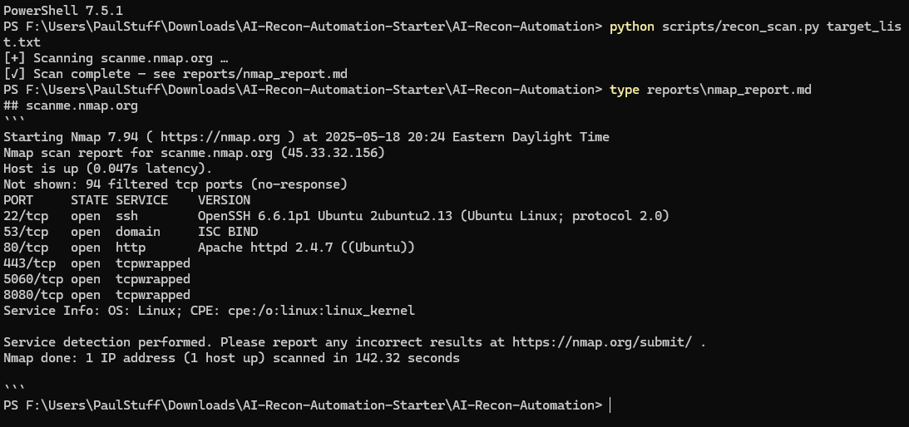

# Readme

# AI-Augmented Recon Toolkit

This project automates reconnaissance for ethical hacking and vulnerability management using PowerShell and Python.  
It includes automated host discovery, Nmap / Nuclei scanning, markdown reporting, and Power BI dashboard visualization—all structured around Microsoft SDL & CIS Level-1 practices.

---

## 🔧 Core Features
- **Automated Host Discovery** (PowerShell / Python)  
- **Vulnerability Scanning** with Nmap and Nuclei  
- **AI-Assisted Reporting** using Claude / ChatGPT for triage & summaries  
- **Secure Scripting** aligned to SDL + CIS benchmarks  
- **Power BI Visualization** of synthetic scan results  
- **Version Control & Documentation** via GitHub & Markdown

---

## 📂 Project Structure
```
scripts/ # PowerShell and Python automation scripts

tests/ # Unit tests and script validation (Pester, Python)

PowerBI/ # Dashboard files (.pbix) or screenshots

images/ # CLI output, charts, or data visualizations

reports/ # Generated markdown reports

example_report.md # Sample output from the toolkit

README.md # You are here
```

---

## 🎓 Learning Track
This project accompanies the published Microsoft Learn plan:  
**AI-Augmented Recon Automation with PowerShell and Python**  
_Published May 2025 • pseudonym author `d1sc1pl3`_  
Plan URL ➜ <https://learn.microsoft.com/en-us/plans/y2wdcet30qqz67>

---

## Roadmap
- [x] Publish Microsoft Learn plan  
- [x] Public GitHub repo with secure structure  
- [ ] Tenable Compliance Export API hook (CIS-L1)  
- [ ] Power BI dashboard (.pbix) demo  

---

## Quick Start
```
# PowerShell ping sweep
.\scripts\host_discovery.ps1 -Targets target_list.txt
```

```
# Python Nmap scan
python scripts/recon_scan.py target_list.txt
```



Output files are written to the **reports/** folder.


## 🚀 Getting Started (Example Use Case)

1. Clone this repo
2. Edit `target_list.txt` with IPs or hostnames
3. Run `host_discovery.ps1` or `recon_scan.py`
4. View output in `example_report.md` or `.pdf`
5. Open Power BI and import `.pbix` from `/PowerBI`

---

## 🔐 Ethical Disclaimer

This toolkit is for educational and authorized penetration testing use only. Do not scan systems you do not own or have permission to test.

---

## 📄 License

MIT License or Creative Commons Attribution-NonCommercial 4.0
